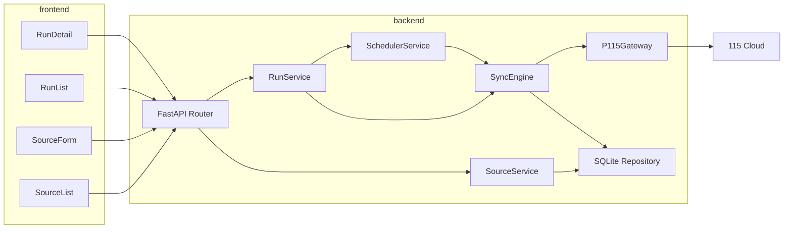

# 技术设计: 115 同步控制台初始化

## 技术方案
### 核心技术
- Python 3.12 + FastAPI：承载 REST API 与后台执行入口。
- SQLAlchemy + SQLite：存储同步源、运行记录、系统设置。
- APScheduler：负责 Cron 定时与启动恢复。
- Vue 3 + Vite + TypeScript + Element Plus：提供本地管理控制台。
- p115client：负责 115 目录操作、秒传初始化与分片上传。

### 实现要点
- 后端采用分层结构：API 层、服务层、仓储层、同步执行层、115 适配层。
- 同步引擎按“扫描目录 → 过滤 → 远端目录准备 → 上传策略执行 → 记录结果”的流水线组织。
- 上传策略使用统一枚举：`fast_only`、`fast_then_multipart`、`multipart_only`。
- SQLite 保存运行状态和文件明细，支持前端轮询展示。
- 前端提供三块核心页面：同步源列表、同步源编辑页、运行记录页。

## 架构设计


## 架构决策 ADR
### ADR-20260330-01: 后端统一负责调度与同步执行，前端仅做控制台
**上下文:** 用户要求前后端项目，但核心能力是本地文件扫描、115 上传与定时调度，这些都更适合后端常驻进程处理。
**决策:** 所有同步执行、定时任务、取消与重试逻辑统一放在后端；前端仅用于配置和查看状态。
**理由:** 避免浏览器环境直接接触 Cookie 与本地文件系统；任务运行更稳定。
**替代方案:** 由前端 Electron 直接执行同步 → 拒绝原因: 本地文件权限与后台任务编排复杂度更高。
**影响:** 后端需承担状态持久化和后台任务管理；前端实现相对轻量。

### ADR-20260330-02: 使用 SQLite 作为单机部署默认存储
**上下文:** 用户明确要求使用 SQLite，且目标场景是本地自部署单用户工具。
**决策:** 首版统一采用 SQLite，数据库文件默认放在 `data/app.db`。
**理由:** 零外部依赖、部署门槛低、足够支撑单机任务记录。
**替代方案:** PostgreSQL / MySQL → 拒绝原因: 增加部署与运维成本。
**影响:** 并发写入能力有限，需要控制任务并发模型。

### ADR-20260330-03: 以上传策略字段统一控制秒传优先与分片上传回退
**上下文:** 用户要求可配置“仅秒传/分片上传”，同时希望系统未来具备更灵活的上传行为。
**决策:** 把上传模式抽象为三态枚举：`fast_only`、`fast_then_multipart`、`multipart_only`。
**理由:** 能覆盖“仅秒传”“仅分片”“秒传失败自动回退”三类常见场景，UI 和后端语义统一。
**替代方案:** 使用两个布尔字段（enable_fast_upload / enable_multipart_upload）→ 拒绝原因: 组合状态更易出现歧义。
**影响:** 所有同步任务均按策略执行，前端和数据库字段保持一致。

## API设计
### [GET] /api/v1/sources
- **请求:** 查询参数可支持 `enabled`、`keyword`
- **响应:** 同步源列表与状态摘要

### [POST] /api/v1/sources
- **请求:** `name`, `local_path`, `remote_path`, `upload_mode`, `suffix_rules`, `exclude_rules`, `cron_expr`, `enabled`
- **响应:** 新建后的同步源详情

### [POST] /api/v1/sources/{source_id}/run
- **请求:** 可选 `force_full`, `retry_failed_only`
- **响应:** 新创建的 `run_id` 与初始状态

### [GET] /api/v1/runs/{run_id}
- **请求:** 可选 `action`, `keyword`, `page`, `page_size`
- **响应:** 运行摘要 + 文件明细分页结果

## 数据模型
```sql
CREATE TABLE sync_sources (
    id INTEGER PRIMARY KEY AUTOINCREMENT,
    name TEXT NOT NULL UNIQUE,
    local_path TEXT NOT NULL,
    remote_path TEXT NOT NULL,
    upload_mode TEXT NOT NULL,
    suffix_rules_json TEXT NOT NULL DEFAULT '[]',
    exclude_rules_json TEXT NOT NULL DEFAULT '[]',
    cron_expr TEXT,
    enabled INTEGER NOT NULL DEFAULT 1,
    created_at TEXT NOT NULL,
    updated_at TEXT NOT NULL
);

CREATE TABLE job_runs (
    id INTEGER PRIMARY KEY AUTOINCREMENT,
    source_id INTEGER NOT NULL,
    trigger_type TEXT NOT NULL,
    status TEXT NOT NULL,
    started_at TEXT,
    finished_at TEXT,
    summary_json TEXT NOT NULL DEFAULT '{}',
    error_message TEXT,
    FOREIGN KEY(source_id) REFERENCES sync_sources(id)
);

CREATE TABLE file_records (
    id INTEGER PRIMARY KEY AUTOINCREMENT,
    run_id INTEGER NOT NULL,
    source_id INTEGER NOT NULL,
    relative_path TEXT NOT NULL,
    file_size INTEGER NOT NULL,
    file_sha1 TEXT,
    suffix TEXT NOT NULL,
    action TEXT NOT NULL,
    remote_file_id TEXT,
    remote_pickcode TEXT,
    message TEXT,
    synced_at TEXT NOT NULL,
    FOREIGN KEY(run_id) REFERENCES job_runs(id),
    FOREIGN KEY(source_id) REFERENCES sync_sources(id)
);

CREATE UNIQUE INDEX uniq_source_relative_path ON file_records(source_id, relative_path);
```

## 安全与性能
- **安全:** 115 Cookie 仅存放于后端 `.env` 或受限文件；前端 API 只返回脱敏状态，不返回明文。
- **安全:** 对本地目录做存在性与可读性校验，拒绝明显非法路径。
- **性能:** 大文件采用分片上传；秒传场景仅需计算 SHA1 与区间哈希。
- **性能:** 后续可增加目录缓存与远端路径 ID 缓存，参考 `/mnt/MoviePilot-Plugins/plugins.v2/p115disk/cache.py` 思路。

## 测试与部署
- **测试:** 为后端服务层与同步策略编写单元测试；对 `P115Gateway` 提供 mock 适配测试；前端表单与列表页编写基础组件测试。
- **部署:** 首版支持本地开发运行（前后端分离）和 Docker Compose；SQLite 文件挂载到宿主机目录。
- **验证:** 以小目录样本验证三种上传模式、后缀过滤、手动执行和 Cron 执行。
