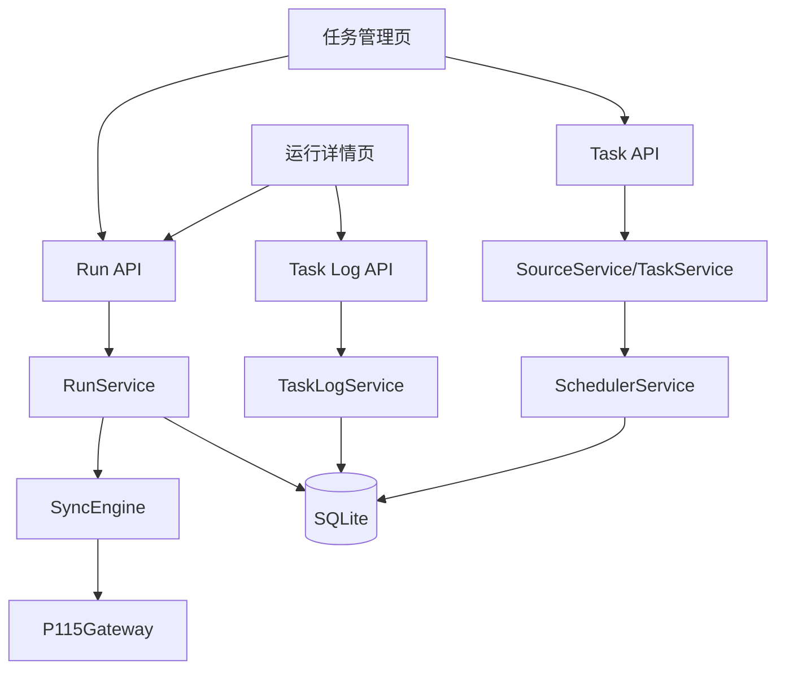

# 技术设计: 多任务同步与任务级日志增强

## 技术方案
### 核心技术
- 继续沿用 FastAPI + SQLAlchemy + SQLite + APScheduler + Vue 3 现有技术栈。
- 在现有 `SyncSource` 基础上强化“任务”语义，不额外引入新的主配置实体。
- 新增 `task_logs`（或 `run_logs`）表，用于持久化任务执行日志。

### 实现要点
- 后端以 `SyncSource` 作为同步任务主实体，对外统一按“任务”命名展示。
- 调度服务增加任务状态快照能力，返回 `next_run_time`、`last_run_at`、`is_scheduled` 等字段。
- 运行服务在关键步骤写入结构化日志，而不是只保存最终文件记录。
- 前端新增任务视图字段与日志区域，支持按任务查看运行与日志。
- API 层拆分出任务列表、任务详情、任务运行历史、任务日志查询等能力。

## 架构设计


## 架构决策 ADR
### ADR-20260330-04: 复用 SyncSource 作为同步任务主实体
**上下文:** 现有实现已经使用 `SyncSource` 表保存任务配置，本质上已具备多任务能力。
**决策:** 不新增新的 `task` 主表，而是将 `SyncSource` 继续作为同步任务实体，对外在接口与界面上统一表达为“同步任务”。
**理由:** 能减少迁移成本，保持现有模型兼容，并快速落地多任务管理能力。
**替代方案:** 新建 `sync_tasks` 表并迁移原 `sync_sources` → 拒绝原因: 增加迁移复杂度且收益有限。
**影响:** 需要在 API/前端命名和文档层做语义统一。

### ADR-20260330-05: 使用持久化任务日志表记录执行过程
**上下文:** 用户要求按任务级展示执行过程日志，仅依赖控制台日志输出无法满足查询与回溯。
**决策:** 新增日志表，以 `run_id + source_id + timestamp + level + stage + message` 形式持久化任务执行日志。
**理由:** 便于历史查询、问题排查与前端展示，且与 SQLite 单机场景匹配。
**替代方案:** 仅写入文本日志文件 → 拒绝原因: 前端查询困难、过滤能力差。
**影响:** 运行服务和同步引擎需在关键步骤显式写日志。

### ADR-20260330-06: 先实现“查询式日志展示”，再预留实时日志扩展
**上下文:** 当前手动执行仍是同步式流程，实时推送日志需要进一步引入后台队列或推送通道。
**决策:** 本阶段优先实现日志持久化与详情查询接口；前端通过轮询/刷新查看日志。
**理由:** 以较低复杂度满足用户“记录显示任务日志”的核心诉求。
**替代方案:** 直接引入 WebSocket/SSE 实时推送 → 拒绝原因: 超出当前迭代范围。
**影响:** 前端首版日志展示偏查询型，但数据模型已兼容未来实时化扩展。

## API设计
### [GET] /api/v1/tasks
- **请求:** 支持 `enabled`、`keyword` 过滤
- **响应:** 任务列表，包含 `id`, `name`, `local_path`, `remote_path`, `cron_expr`, `enabled`, `last_run_at`, `last_run_status`, `next_run_time`

### [GET] /api/v1/tasks/{task_id}
- **请求:** 返回任务详情
- **响应:** 单个任务配置与调度状态

### [POST] /api/v1/tasks/{task_id}/toggle
- **请求:** `enabled: boolean`
- **响应:** 更新后的任务状态与调度状态

### [GET] /api/v1/tasks/{task_id}/runs
- **请求:** 分页参数
- **响应:** 某任务的运行记录列表

### [GET] /api/v1/runs/{run_id}/logs
- **请求:** 支持 `level`、`stage` 过滤
- **响应:** 某次执行的任务级日志列表

## 数据模型
```sql
CREATE TABLE task_logs (
    id INTEGER PRIMARY KEY AUTOINCREMENT,
    run_id INTEGER NOT NULL,
    source_id INTEGER NOT NULL,
    level TEXT NOT NULL,
    stage TEXT NOT NULL,
    message TEXT NOT NULL,
    created_at TEXT NOT NULL,
    FOREIGN KEY(run_id) REFERENCES job_runs(id),
    FOREIGN KEY(source_id) REFERENCES sync_sources(id)
);

CREATE INDEX idx_task_logs_run_id ON task_logs(run_id);
CREATE INDEX idx_task_logs_source_id ON task_logs(source_id);
CREATE INDEX idx_task_logs_stage ON task_logs(stage);
```

## 安全与性能
- **安全:** 任务日志写入前统一经过脱敏处理，禁止落库 Cookie、Authorization、原始签名参数。
- **安全:** 调度状态接口只返回执行状态与时间，不返回底层凭证信息。
- **性能:** 日志粒度控制在“任务阶段 + 关键文件事件”级别，避免对大量文件逐行记录造成 SQLite 压力。
- **性能:** 运行详情接口采用分页或限制条数，防止日志量过大导致页面卡顿。

## 测试与部署
- **测试:** 增加调度状态快照、日志写入、日志查询与任务列表字段测试。
- **前端验证:** 验证任务列表页能展示多个任务与独立 Cron，运行详情页能展示日志时间线。
- **部署:** 无需新增基础设施，仅需自动建表和前端页面更新。
