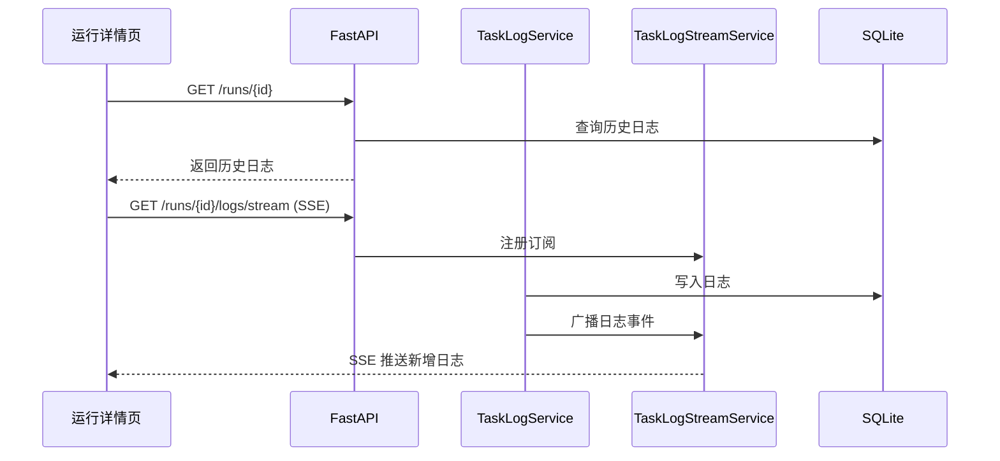

# 技术设计: 实时任务日志推送

## 技术方案
### 核心技术
- 后端继续沿用 FastAPI。
- 实时推送层采用 SSE（Server-Sent Events）。
- 日志持久化继续复用现有 `task_logs` 表。
- 前端使用浏览器原生 `EventSource` 建立订阅。

### 实现要点
- 新增 `TaskLogStreamService`，按 `run_id` 维护订阅队列。
- `TaskLogService.log()` 在写入数据库后，向对应 `run_id` 广播新增日志。
- 后端新增 `GET /api/v1/runs/{run_id}/logs/stream` SSE 接口。
- 前端运行详情页进入后：先调用历史日志接口，再建立 SSE 连接持续接收日志。
- 前端对日志按 `id` 去重，并在收到结束状态或页面卸载时关闭连接。

## 架构设计

## 架构决策 ADR
### ADR-20260330-07: 使用 SSE 实现首版实时任务日志
**上下文:** 需求是后端向前端单向持续推送日志，不涉及前端向后端双向通信。
**决策:** 首版使用 SSE，而不是 WebSocket。
**理由:** SSE 更轻量、实现简单、浏览器原生支持好，足以覆盖日志推送场景。
**替代方案:** WebSocket → 拒绝原因: 状态管理和接入复杂度更高。
**影响:** 前端需使用 `EventSource`，后端需维护订阅清理逻辑。

### ADR-20260330-08: 历史日志与实时日志分层获取
**上下文:** 页面进入时既要看到历史日志，又要能收到后续新增日志。
**决策:** 保留现有历史日志查询接口，实时接口只负责推送新增日志。
**理由:** 避免实时接口兼顾历史回放逻辑，降低实现复杂度。
**替代方案:** 实时接口首包返回全部历史日志 → 拒绝原因: 容易与持久化查询逻辑重复，且不利于分页扩展。
**影响:** 前端需做“历史加载 + 实时订阅”的两段式处理。

## API设计
### [GET] /api/v1/runs/{run_id}/logs/stream
- **请求:** SSE 长连接
- **响应事件:**
  - `log`: 单条新增日志
  - `status`: 任务状态变更（如 finished / failed / cancelled）
  - `heartbeat`: 保活心跳

## 数据模型
- 无新增持久化表。
- 广播事件复用 `TaskLogRead` 结构。

## 安全与性能
- **安全:** SSE 推送的数据继续使用脱敏后的日志内容，不直接透传原始异常对象。
- **性能:** 仅对订阅中的 `run_id` 广播日志，避免全局广播。
- **性能:** 增加心跳与连接清理机制，防止长连接泄漏。

## 测试与部署
- **测试:** 增加日志广播、SSE 订阅、连接关闭清理测试。
- **前端验证:** 验证运行详情页在任务执行过程中能自动滚动追加日志，并在结束后停止订阅。
- **部署:** 无需新增基础设施；若后续部署到反向代理，需确认代理支持 SSE 长连接。
