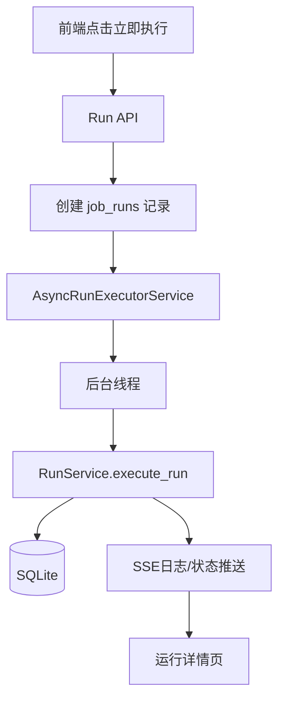

# 技术设计: 手动执行后台异步化

## 技术方案
### 核心技术
- 后端继续沿用 FastAPI。
- 后台执行采用 Python 线程池或 `threading.Thread` 启动后台作业。
- 数据访问继续使用 SQLAlchemy，但后台线程独立创建会话。
- 实时日志与状态推送复用现有 `TaskLogService` 与 SSE 链路。

### 实现要点
- 新增 `AsyncRunExecutorService`，负责在后台线程中执行 `RunService.execute_run()`。
- `POST /tasks/{id}/run` 和 `POST /runs/{id}/retry` 不再直接执行任务，只负责创建运行记录并提交到后台执行器。
- APScheduler 的定时任务触发也尽量复用同一后台执行入口，统一执行模型。
- 前端触发后直接跳转到运行详情页，由详情页观察状态变化与实时日志。

## 架构设计

## 架构决策 ADR
### ADR-20260331-01: 手动执行首版采用进程内后台线程
**上下文:** 需要让接口快速返回，同时不引入额外的队列基础设施。
**决策:** 首版采用进程内后台线程执行手动任务。
**理由:** 实现成本低、能快速满足“真正后台异步任务”诉求。
**替代方案:** Celery / RQ / 独立消息队列 → 拒绝原因: 当前单机部署场景下引入成本过高。
**影响:** 单进程部署可用，未来若扩展到多实例再演进到独立任务队列。

### ADR-20260331-02: 后台执行统一复用 RunService
**上下文:** 当前 `RunService` 已经承载状态更新、日志写入、文件记录和 SSE 联动。
**决策:** 后台线程不重写执行逻辑，而是通过独立数据库会话调用 `RunService.execute_run()`。
**理由:** 避免双份执行逻辑，降低状态和日志不一致风险。
**替代方案:** 新建一套后台任务逻辑 → 拒绝原因: 容易造成维护分叉。
**影响:** `RunService` 需保持线程外可安全实例化。

## API设计
### [POST] /api/v1/tasks/{task_id}/run
- **请求:** 手动触发参数
- **响应:** 立即返回 `run_id`, `status=pending`

### [POST] /api/v1/runs/{run_id}/retry
- **请求:** 以某次运行为基准创建重试
- **响应:** 立即返回新 `run_id`, `status=pending`

## 数据模型
- 无新增核心表。
- `job_runs.status` 将更频繁体现 `pending` 过渡状态。

## 安全与性能
- **安全:** 后台线程创建独立数据库会话，避免请求上下文泄漏。
- **性能:** 手动执行接口响应显著缩短，任务执行从 Web 请求生命周期中解耦。
- **性能:** 需限制后台线程数量，避免用户频繁点击导致线程泛滥。

## 测试与部署
- **测试:** 增加异步执行器、接口立即返回、状态流转与并发保护测试。
- **前端验证:** 验证点击后可立即进入运行详情，并看到状态从 `pending` 变为 `running`。
- **部署:** 单机模式下无需新增基础设施；如未来改为多实例部署，再评估独立任务队列。
