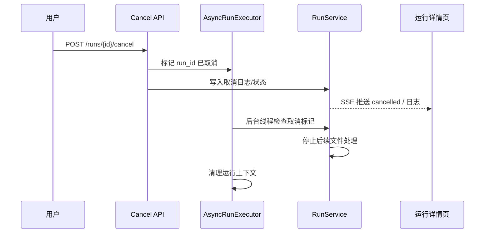

# 技术设计: 可中断后台任务执行

## 技术方案
### 核心技术
- 继续沿用现有后台线程执行器。
- 在执行器中增加 `run_id -> cancel_flag` 管理。
- 在运行服务内通过 `ensure_not_cancelled()` 等检查点统一判断取消状态。

### 实现要点
- `AsyncRunExecutorService` 新增：注册运行上下文、标记取消、查询是否已取消、结束后清理上下文。
- `RunService.execute_run()` 在开始前、扫描后、每个文件处理前后检查是否收到取消信号。
- 取消接口优先通知执行器，再由运行服务写入取消日志与状态。
- 若任务已是 `pending`，可直接取消并避免真正进入执行阶段。

## 架构设计

## 架构决策 ADR
### ADR-20260401-01: 首版采用“检查点中断”而非强杀线程
**上下文:** Python 线程不适合被外部强制终止，当前上传流程也未完全支持细粒度中断。
**决策:** 首版取消采用“取消信号 + 检查点中断”策略。
**理由:** 更安全、实现简单、不会破坏数据库会话和运行上下文。
**替代方案:** 强制终止线程 → 拒绝原因: 风险高、容易造成状态不一致。
**影响:** 当前文件可能执行完成后才停止，但不会继续处理后续文件。

## API设计
### [POST] /api/v1/runs/{run_id}/cancel
- **请求:** 无
- **响应:** 立即返回最新运行状态
- **行为:** 若运行中则登记取消信号；若待执行则直接取消；若已结束则返回当前状态

## 数据模型
- 无新增核心表。
- `job_runs.status` 继续使用 `cancelled`。

## 安全与性能
- **安全:** 不强杀线程，避免不一致状态。
- **性能:** 取消检查只在关键检查点执行，开销极低。
- **性能:** 执行器需在任务结束时释放取消标记和占用状态。

## 测试与部署
- **测试:** 增加 pending 取消、running 取消、检查点停止和上下文清理测试。
- **前端验证:** 验证取消后日志与状态能快速反映中断。 
