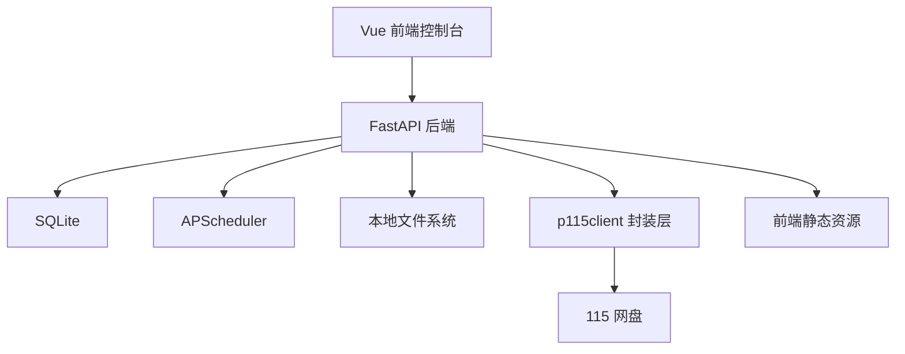
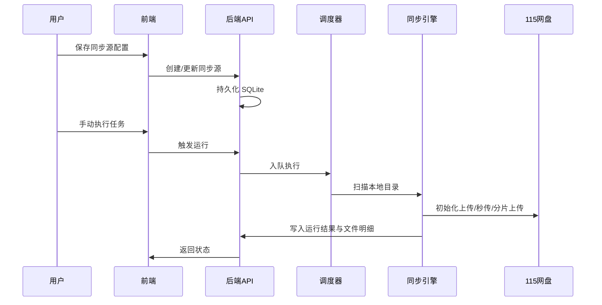

# 架构设计

## 总体架构

## 技术栈
- **后端:** Python 3.12 / FastAPI / SQLAlchemy / APScheduler / Pydantic
- **前端:** Vue 3 / Vite / TypeScript / Element Plus / Pinia
- **部署:** 支持开发态前后端分离，也支持单容器镜像由 FastAPI 统一对外提供 API + 前端页面
- **数据:** SQLite（数据库文件与运行时数据目录分离，默认 `/app/db/app.db`）

## 核心流程

## 重大架构决策
完整的 ADR 存储在各变更的 how.md 中，本章节提供索引。

| adr_id | title | date | status | affected_modules | details |
|--------|-------|------|--------|------------------|---------|
| ADR-20260330-01 | 后端统一负责调度与同步执行，前端仅做控制台 | 2026-03-30 | ✅已采纳 | backend-api, job-scheduler, frontend-console | [helloagents/history/2026-03/202603300837_115_sync_console/how.md#adr-20260330-01-后端统一负责调度与同步执行前端仅做控制台](../history/2026-03/202603300837_115_sync_console/how.md#adr-20260330-01-后端统一负责调度与同步执行前端仅做控制台) |
| ADR-20260330-02 | 使用 SQLite 作为单机部署默认存储 | 2026-03-30 | ✅已采纳 | backend-api, job-scheduler | [helloagents/history/2026-03/202603300837_115_sync_console/how.md#adr-20260330-02-使用-sqlite-作为单机部署默认存储](../history/2026-03/202603300837_115_sync_console/how.md#adr-20260330-02-使用-sqlite-作为单机部署默认存储) |
| ADR-20260330-03 | 以上传策略字段统一控制秒传优先与分片上传回退 | 2026-03-30 | ✅已采纳 | sync-engine, p115-gateway | [helloagents/history/2026-03/202603300837_115_sync_console/how.md#adr-20260330-03-以上传策略字段统一控制秒传优先与分片上传回退](../history/2026-03/202603300837_115_sync_console/how.md#adr-20260330-03-以上传策略字段统一控制秒传优先与分片上传回退) |
